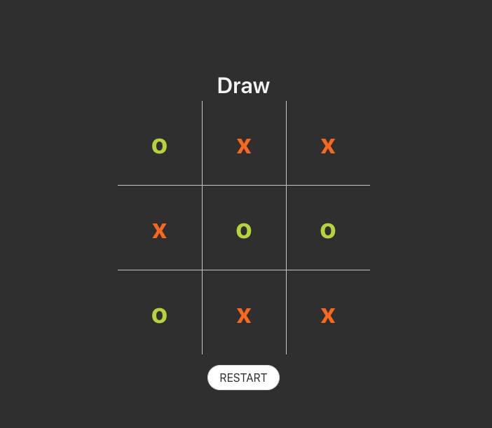

# Tic Tac Toe

A Tic-Tac-Toe game which is unconquerable thanks to artifcial intelligence.


## Feauteres

* Elegant, Simple UI
* Instant Game Play



### Prerequisites
 Install latest version of 'node.js' and 'npm' in order to start development.
```
Vue  (Vue-Cli)
Buefy 
```

### Installing

Install dependencies
- Go to project directory and use the command below.

```
npm install
```

### Start Program

Go to project directory and use the command below

```
npm run serve 
```


## Built With

* [Vue JS](https://vuejs.org/) - The progressive javascript framework


## Authors

 [Erdi Doğan](https://www.linkedin.com/in/doganerdi) 


## License

This project is licensed under the MIT License 


